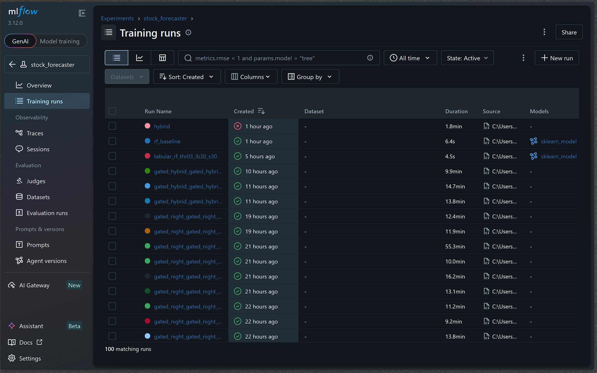
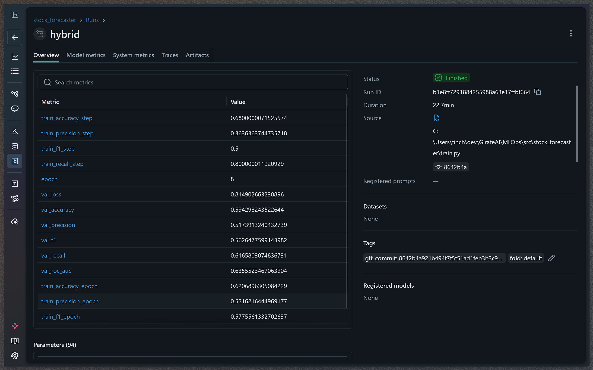
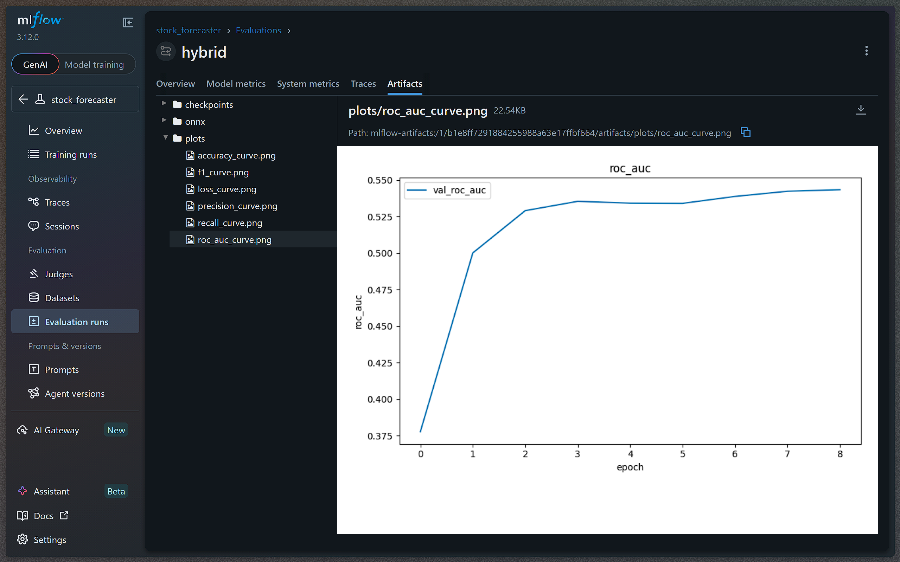
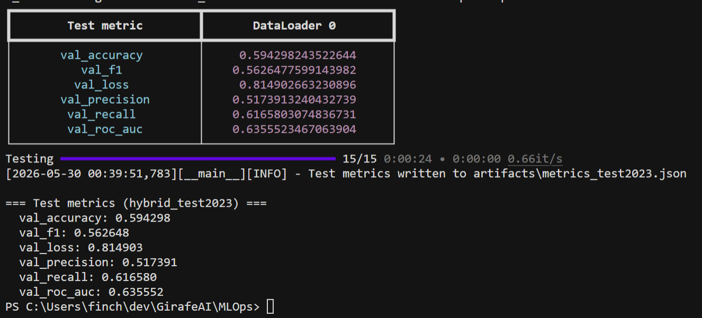
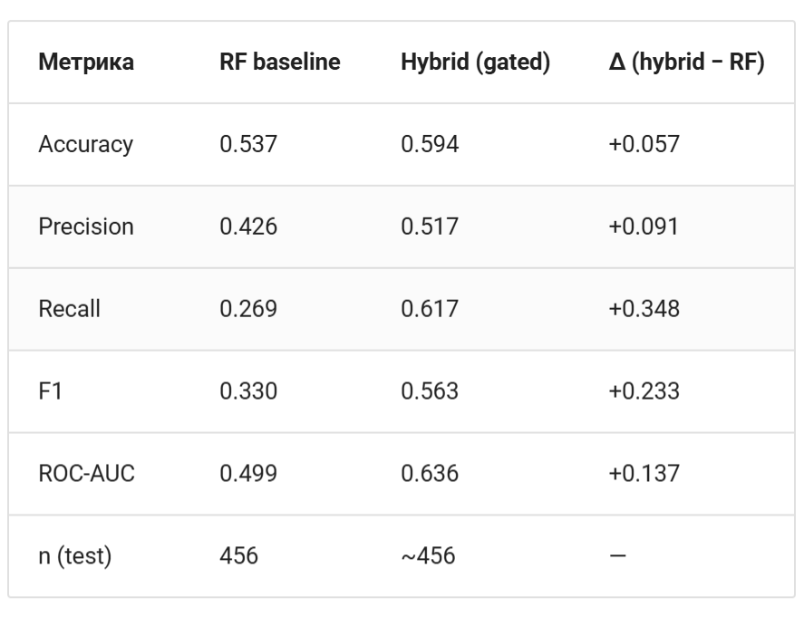
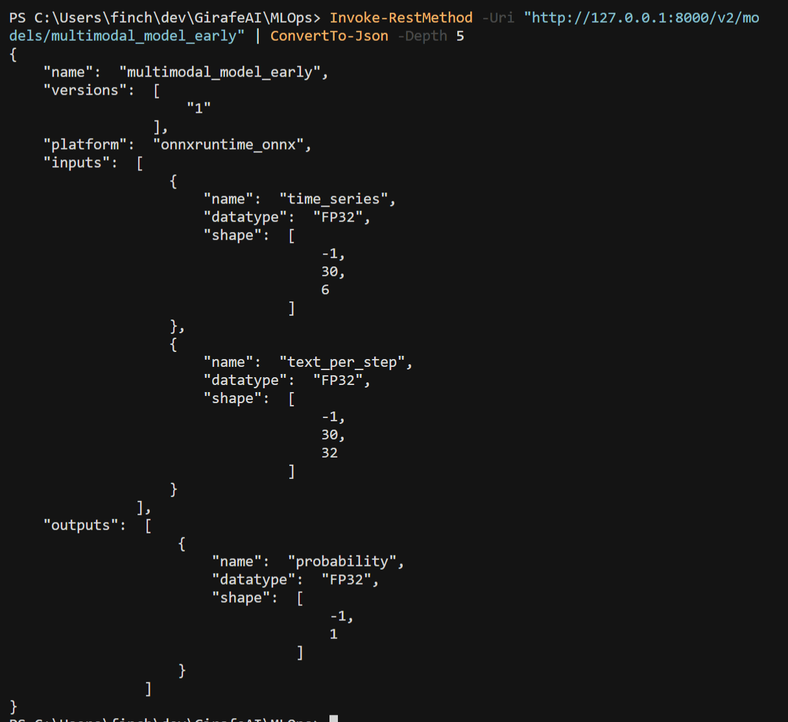
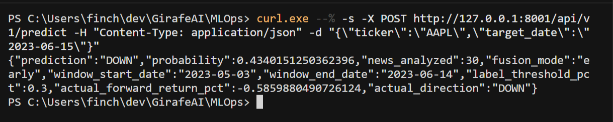
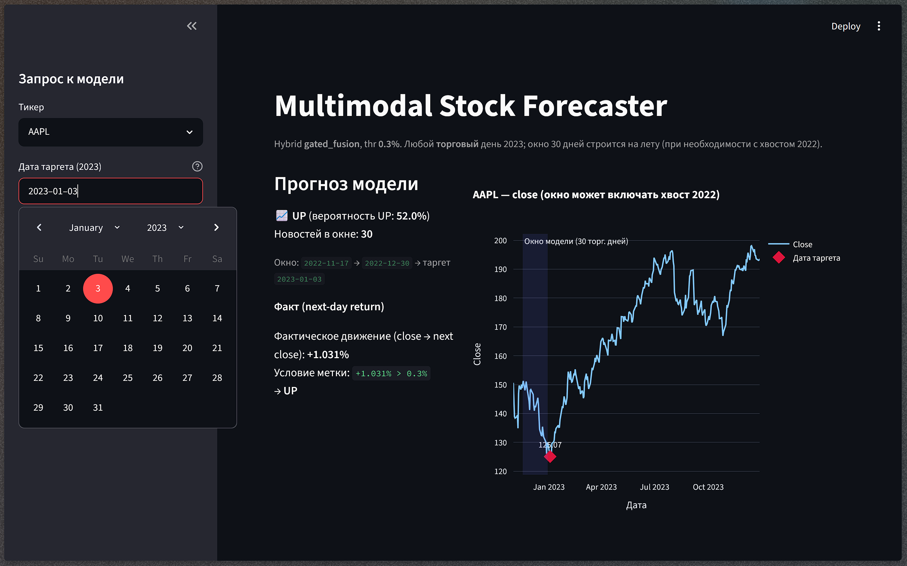
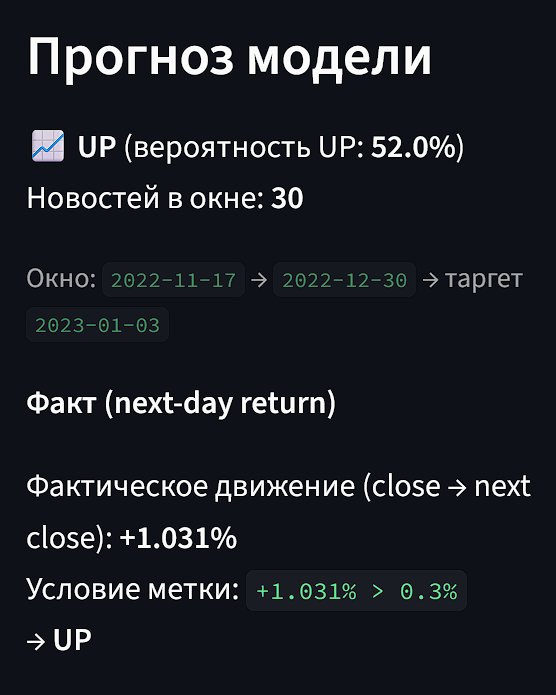
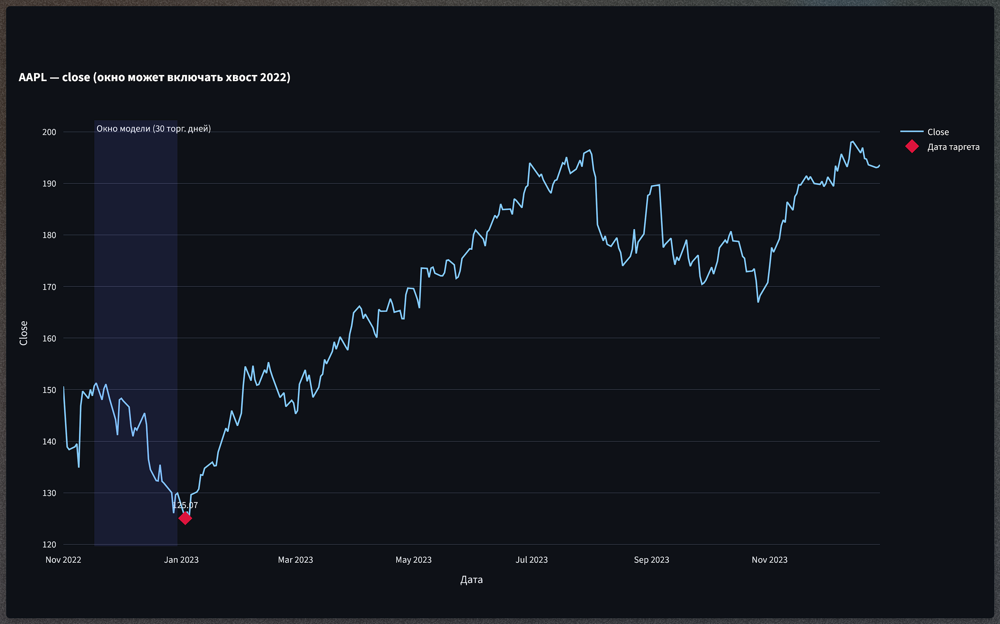

# Мультимодальная система прогнозирования динамики стоимости акций на основе рыночных новостей и исторических котировок

**Студент:** Евсеев Иван Александрович

## 1. Постановка задачи

**Что делаем:** Разрабатываем систему, которая предсказывает направление движения цены акции (рост/падение) на следующий торговый день.

**Зачем это нужно:** Финансовые рынки крайне чувствительны к новостному фону. Классические модели учитывают только цифры, упуская важные события (отчёты, санкции, слияния). Мультимодальный подход позволяет модели «понимать» контекст событий и точнее оценивать риски и возможности для инвестиций.

## 2. Формат входных и выходных данных

**Вход (Input):**

- **Числовой вектор (Time Series):** Окно из последних N торговых дней (30 дней), где для каждого дня заданы 6 параметров: `[Open, High, Low, Close, Volume, % change]`. Размерность тензора: `(batch_size, N, 6)`.
- **Текстовые данные (News):** Новости по компании за те же N дней, выровненные point-in-time с котировками. В финальной модели — **early fusion**: по одной строке на каждый из N дней (токенизация внутри FinBERT).

**Выход (Output):**

- Вероятность роста цены на следующий день (бинарная классификация). Порог метки **`label_threshold_pct = 0.3%`**: `1` — рост > 0.3%, `0` — стагнация или падение. Размерность: `(batch_size, 1)`.

### Пример данных (Data Example для обучения/инференса)

Один семпл (до векторизации текста) на входе в модель:

```json
{
  "ticker": "AAPL",
  "target_date": "2023-01-15",
  "time_series": [
    {
      "date": "2023-01-14",
      "open": 150.0,
      "high": 152.0,
      "low": 149.5,
      "close": 151.0,
      "volume": 85000000,
      "change_pct": 0.6
    },
    {
      "date": "2023-01-13",
      "open": 149.0,
      "high": 150.5,
      "low": 148.0,
      "close": 150.1,
      "volume": 78000000,
      "change_pct": 0.7
    }
  ],
  "news_context": [
    "Apple announces new VR headset launch date.",
    "Foxconn reports minor delays in iPhone 15 production."
  ],
  "target_label": 1
}
```

## 3. Метрики успеха (с обоснованием диапазонов)

В алготрейдинге случайное угадывание даёт 50%. Любое стабильное превышение порога в 53–55% на дистанции считается крайне успешным для извлечения прибыли (Edge).

1. **Precision (Точность): ожидаемый диапазон > 55%**.
   _Критичная метрика для инвестора._ Важно минимизировать ложные входы в сделку.
2. **Accuracy (Общая точность): ожидаемый диапазон > 54%**.
   Показывает общую долю верных прогнозов направления.
3. **F1-Score: ожидаемый диапазон > 50%**.
   Важен из-за дисбаланса классов.
4. **Recall (Полнота): ожидаемый диапазон > 50%**.
   Нужен, чтобы модель не предсказывала всегда `0`.
5. **ROC-AUC: ожидаемый диапазон > 0.55**.
   Разделяющая способность модели независимо от порога вероятности.

## 4. Валидация и тест

Используется **Time Series Split** (нельзя перемешивать данные случайно — иначе data leakage):

- **Train:** 2018–2021
- **Validation:** 2022
- **Test:** 2023

Для воспроизводимости фиксируются `random_seed` и lookback window (`seq_len=30`).

## 5. Описание датасета

- **Источник:** FNSPID (Financial News and Stock Price Integration Dataset).
- **Ссылка:** [huggingface.co/datasets/Zihan1004/FNSPID](https://huggingface.co/datasets/Zihan1004/FNSPID)
- **Объём:** полный датасет ~30 ГБ; в проекте — подмножество по топ-80 ликвидным тикерам → `data/processed/fnspid_subset_thr03.parquet` (DVC, не в Git).
- **Особенности:** point-in-time выравнивание новостей и котировок.
- **Проблемы:** шумные новости; неравномерная частота публикаций.

## 6. Моделирование

**Бейзлайн:**

Tabular-модель на flattened OHLCV (`30×6=180` признаков), без новостей. По умолчанию — **Random Forest**; через `baseline.model_type` также доступны `hist_gradient_boosting` и `xgboost` (`conf/baseline/default.yaml`).

**Основная модель (мультимодальная архитектура):**

1. **TS-Branch:** `iTransformer` (inverted embedding + transformer-encoder), блок нормализации `RevIN`.
2. **Text-Branch:** `FinBERT` (`ProsusAI/finbert`), заморожен; CLS-эмбеддинг + проекция в 32-d.
3. **Fusion Layer:** `gated_fusion` (early) — per-day gate из текста на числовые каналы OHLCV.
4. **Head:** `Linear(256 → 1)` → sigmoid → порог 0.5.

```text
(OHLCV + FinBERT по дням) ──► gated fusion ──► iTransformer ──► latent ──► P(рост)
```

Конфиги: `conf/model/early.yaml`, `conf/model/hybrid.yaml`.

## 7. Внедрение (Packaging & Inference)

**Формат модели:**

После обучения в PyTorch Lightning веса экспортируются в **ONNX** (`make export`) и размещаются в Triton (`triton_model_repo/multimodal_model_early/`).

**Архитектура сервиса:**

1. **NVIDIA Triton Inference Server** хостит `.onnx`-модель (динамический батчинг, `onnxruntime_onnx`).
2. **FastAPI** принимает `ticker` + `target_date`, собирает point-in-time окно из parquet, кодирует текст через FinBERT, запрашивает Triton, возвращает прогноз и факт.
3. **Streamlit UI** — календарь 2023, выбор тикера, графики OHLCV, сравнение прогноза с фактом.

```text
Streamlit UI (src/ui/app.py) ──HTTP──► FastAPI (service/app.py)
                                           │
                                           ├── historical lookup (2023)
                                           └── HTTP ──► Triton (ONNX)
```

**MLOps-стек:**

| Компонент     | Реализация                              |
| ------------- | --------------------------------------- |
| Зависимости   | `uv`, `pyproject.toml`, lock-файл       |
| Качество кода | `pre-commit` + `ruff` + prettier        |
| Данные        | DVC (`make dvc-pull` / `make dvc-push`) |
| Конфигурация  | Hydra `conf/`                           |
| Обучение      | PyTorch Lightning + MLflow              |
| Inference     | ONNX → Triton + FastAPI + Streamlit     |

**Быстрый старт** (`make help`):

```bash
make install
make dvc-pull          # после git clone
make train             # hybrid + MLflow
make baseline
make eval
make export
make stack-up          # http://127.0.0.1:8501
```

Подробная документация: [docs/index.md](docs/index.md) · `make docs` → http://127.0.0.1:8002

## Скриншоты




















