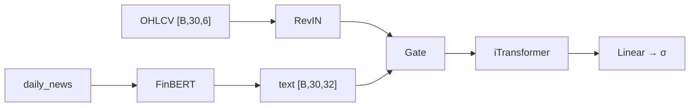

# Архитектура

Финальная модель: **hybrid gated fusion**, early fusion, порог метки **0.3%**.

## Компоненты

| Ветка      | Роль                                                       |
| ---------- | ---------------------------------------------------------- |
| **TS**     | iTransformer (TSLib): inverted embedding + encoder         |
| **Text**   | FinBERT (`ProsusAI/finbert`), frozen; CLS → Linear(768→32) |
| **Fusion** | `gated_fusion`: per-day gate из текста на OHLCV-признаки   |
| **Head**   | Linear(256→1) → sigmoid                                    |

```text
(OHLCV + FinBERT по дням) ──► gated fusion ──► iTransformer ──► latent ──► P(рост)
```

## Гиперпараметры (hybrid)

| Параметр                    | Значение |
| --------------------------- | -------- |
| `seq_len` / `window_stride` | 30 / 30  |
| `d_model`                   | 96       |
| `n_heads` / `e_layers`      | 2 / 2    |
| `d_ff`                      | 384      |
| `dropout`                   | 0.30     |
| `text_feat_dim`             | 32       |
| `classifier_input_dim`      | 256      |
| Trainable params            | ~402K    |
| Total (с FinBERT)           | ~109M    |

Конфиги: `conf/model/early.yaml`, `conf/model/hybrid.yaml`, `conf/data/thr03.yaml`.

## Схема forward



## Бейзлайн

**Tabular baseline** на flattened OHLCV (`30×6=180` признаков), без новостей.
По умолчанию Random Forest; опционально `hist_gradient_boosting` или `xgboost`.

```bash
make baseline
```

## ONNX и Triton

- FinBERT **не** в ONNX — кодируется в FastAPI/Streamlit.
- Triton получает `time_series [30,6]` + `text_per_step [30,32]`.
- Backend: `onnxruntime_onnx`, модель `multimodal_model_early`.

Подробнее: [Инференс](inference.md).

## Baseline vs hybrid (test 2023, stride=30)

!!! warning "Не dense-сравнение"
Метрики ниже — test 2023, `window_stride=30`, порог 0.5. Это **не** dense-оценка.
Подробнее: [Оценка → Baseline vs hybrid](evaluation.md#baseline-vs-hybrid-test-2023-stride30).

| Метрика   | RF baseline | Hybrid |
| --------- | ----------- | ------ |
| Accuracy  | 0.537       | 0.594  |
| Precision | 0.426       | 0.517  |
| Recall    | 0.269       | 0.617  |
| F1        | 0.330       | 0.563  |
| ROC-AUC   | 0.499       | 0.636  |

Dense-оценка (все дни 2023, inference-style) даёт более низкие метрики — ближе к реальному UI/API.
